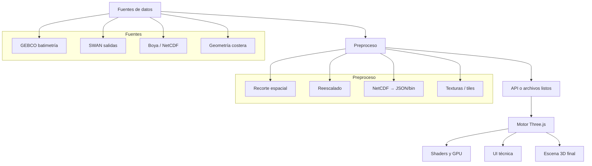

# Arquitectura de WaveThree

## Visión general

WaveThree separa claramente adquisición, preproceso, motor visual y presentación. El navegador no resuelve física completa; lee resultados ya calculados y los convierte en escena 3D.



## Principios arquitectónicos

1. **Separación cálculo ↔ visualización** — el navegador visualiza, no simula desde cero
2. **Escenarios autocontenidos** — cada estado de mar es un JSON que el visor puede cargar sin depender del NetCDF original
3. **Capas acumulativas** — Fase 1 (Gerstner) → Fase 3 (iFFT espectral) sin reescribir la escena
4. **Datos abiertos primero** — GEBCO, SWAN, NetCDF público como fuentes prioritarias

## Capas del sistema

### 1. Capa de datos (`data/`)

- `raw/` — descargas originales (NetCDF, GeoTIFF, ASCII)
- `processed/` — datos convertidos a formatos web-friendly (JSON, bin, PNG heightmap)
- `scenarios/` — escenarios autocontenidos en JSON

### 2. Capa de preproceso (`apps/preprocessing/`)

Scripts en Python/Node.js para:
- Recortar dominio espacial de GEBCO
- Convertir NetCDF de SWAN a JSON de escenario
- Generar heightmaps de batimetría
- Remuestrear y comprimir

### 3. Capa de visualización (`src/`)

| Módulo | Responsabilidad |
|--------|----------------|
| `scene/` | Configuración de escena, cámara, luces, controles |
| `ocean/` | Superficie del mar (Gerstner → iFFT espectral) |
| `bathymetry/` | Carga y representación del fondo marino |
| `structures/` | Modelos de diques, espigones, costa |
| `ui/` | Panel de parámetros, overlay, controles |
| `loaders/` | Parsers de NetCDF, JSON de escenario, GLB |

### 4. Capa de aplicación (`apps/web-viewer/`)

Punto de entrada del visor web. Bundler (Vite), dependencias, HTML principal.

## Flujo de datos de un escenario

```
NetCDF/SWAN  ──>  preprocessing/  ──>  data/scenarios/escenario.json
                                            │
GEBCO grid   ──>  preprocessing/  ──>  data/processed/batimetria.bin
                                            │
                                            ▼
                                     web-viewer/src/loaders/
                                            │
                                            ▼
                                     src/ocean/ + src/bathymetry/
                                            │
                                            ▼
                                     Escena Three.js renderizada
```

## Formato de escenario

Cada estado de mar se serializa a JSON autocontenido:

```json
{
  "id": "temporal_2026_01_17_1200",
  "label": "Temporal enero 2026",
  "location": "zona piloto",
  "time": "2026-01-17T12:00:00Z",
  "wave": {
    "hs": 3.2,
    "tp": 8.7,
    "dir": 245
  },
  "wind": {
    "speed": 17.5,
    "dir": 240
  },
  "bathymetry": "gebco_tile_01.bin",
  "structure": "dique_piloto.glb"
}
```

## Decisiones técnicas

| Decisión | Opción | Motivo |
|----------|--------|--------|
| Motor 3D | Three.js | Estable, WebGPU, ecosistema amplio |
| GPU | WebGPU via Three.js | Mejor para compute shaders iFFT |
| MVP olas | Gerstner waves | Desarrollo rápido, validación temprana |
| Océano avanzado | JONSWAP + iFFT | Base física real, espectro desde datos |
| Batimetría | GEBCO global | Gratuito, global, netCDF/GeoTIFF |
| Modelo oleaje | SWAN (datos precomputados) | Referencia abierta, validada |
| Lectura NetCDF | netcdfjs | Funciona en navegador y Node |

## Evolución prevista

```
Fase 0: Investigación ──> Fase 1: MVP Gerstner ──> Fase 2: Datos reales
       │                                                │
       └───> Documentación, fuentes, ADRs               │
                                                        ▼
                                           Fase 3: iFFT espectral
                                                  │
                                                  ▼
                                        Fase 4: Costa + estructuras
                                                  │
                                                  ▼
                                        Fase 5: Producto técnico
```